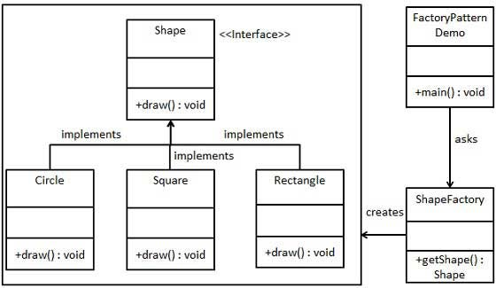

# Factory Method

[Retour au sommaire](../readme.md)

## Problèmatique de départ

Lors de la création d'instance de classes héritant de la même **classe abstraite** ou de la même **interface**, et que l'on veut créer une méthode de construction globale, on doit arriver à un moment où il faut défénir à quelle classe enfant l'objet appartient. Pour cela, on doit forcément établir un critère de distinction et l'évaluer systématiquement.

## Principe et fonctionnement

Pour contrer ce problème, il est possible de mettre en place une **Factory**. Cette **Factory** va permettre de déléguer la constuction des objets (en sa qualité d'"usine") à la bonne classe sans être connue de la fonction qui l'appelle. Cela peut permettre de gérer différentes sources de données.

## Structure

La structure complète consiste en une **interface de fabrication** qui définit la méthode de création, la classe de la **Factory** qui implémenente l'**interface de fabrication**, une interface qui sera commune à toutes les classes qui pourront être instanciée via la **Factory** et les classes qui vont être instanciée.

[Source du schéma](https://medium.com/nerd-for-tech/factory-design-pattern-a570cc3ad804)

[Exemple en code](./exemple.php)

## Avantages / Inconvénients

|                                                      Avantages                                                     |                                                    Inconvénients                                                   |
|--------------------------------------------------------------------------------------------------------------------|--------------------------------------------------------------------------------------------------------------------|
| Respecte le principe SRP : la **Factory** à pour responsabilité de créer des objets  |Besoin d'ajouter de nombreuses sous-classes |
|Permet de faire facilement des mocks |                                                                                                                    |
| Facile d'ajouter une classe sans tout modifier : principe ouvert/fermé |                                                                                                                    |

## Cas d'usage

- Les objets changent régulièrement de types
- On ne connait pas le type de l'objet à l'avance